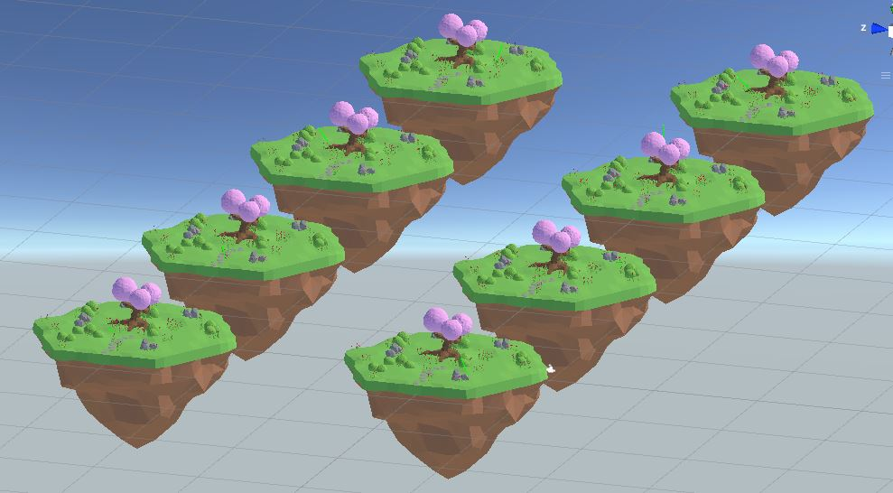
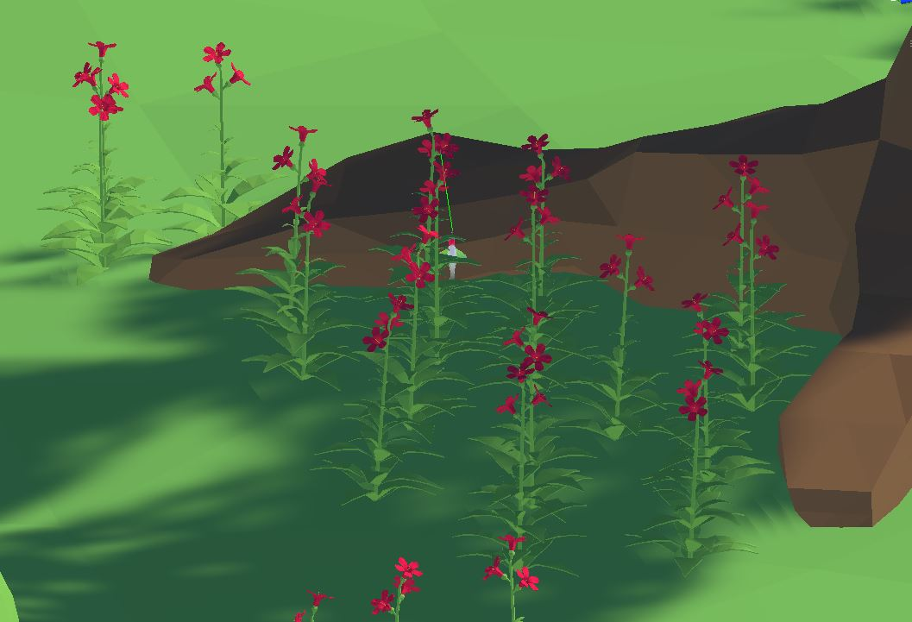
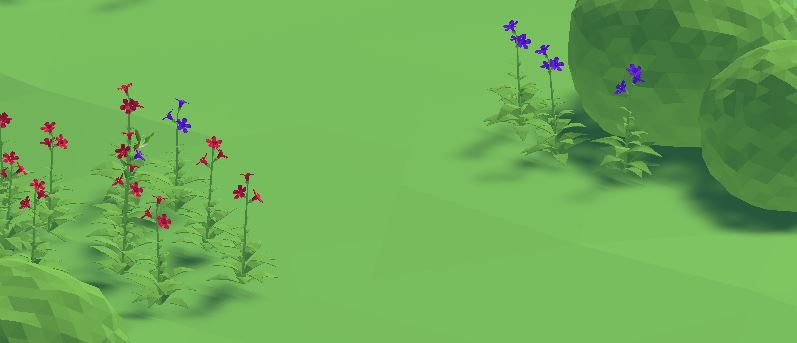
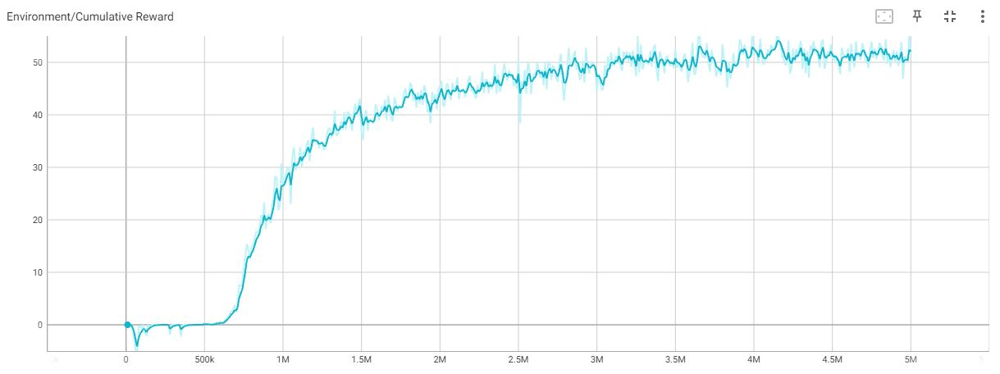

# HummingBird
Reinforcement learning project using Unity ML-agents (release 19)

The goal of this project is to design a Hummingbird agent capable of drinking nectar from flowers in a randomly generated environment.

# Observations

The hummingbird agent has the following information from the environment :

• the agents local rotation(4 observations).

• a normalized vector pointing to the nearest flower(3 observations).

• a dot product that indicates whether the beak tip is in front of the nearest flower.

• a dot product that indicates whether the beak is pointing toward the nearest flower.

• the relative distance from the beak tip to the nearest flower (1 observation).

For a total of 10 observations. Only the latest environment observation is fed to the agent, no observation stacking is performed.

# Actions
The agents actions are float values controlling its pose in space :

• move value x (+1 = right, -1 = left)

• move vector y (+1=up , -1 = down)

• move vector z (+1 = forward, -1 = backward)

• pitch angle (+1 = pitch up, -1 = pitch down)

• yaw angle (+1 = turn right, -1 = turn left)

# Reward

The agent gets a reward of 0.1 each timestep it's drinking flower nectar as well as a bonus reward proportionnal to how well it is aligned with the flower. It gets a negative reward of 0.5 when it collides with the ground or gets out of the limits of the environment.

# Training

The agent is trained using PPO over 5e6 steps. To speed up training 8 independent environments with a hummingbird agent are simulated and their experiences are collected by the Academy :

At first the agent has trouble reaching a flower and drinking its nectar but it eventually gets better later in the training : 

A blue flower means that its nectar has been collected while a red one is still full.

The improvment of the hummingbirds' policies is shown by the average cumulative reward received by each agent during an episode improving as training goes :

# Compete with the agent

It's possible to play against the trained agent by putting 2 hummingbirds on one island and setting the behavior of one agent to Heuristic (having one human player controlling an agent with the keyboard). After training the agent achieves superhuman performance.
